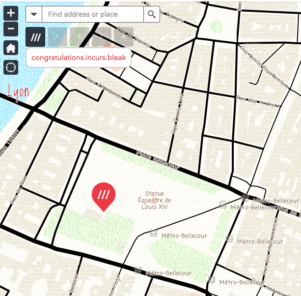
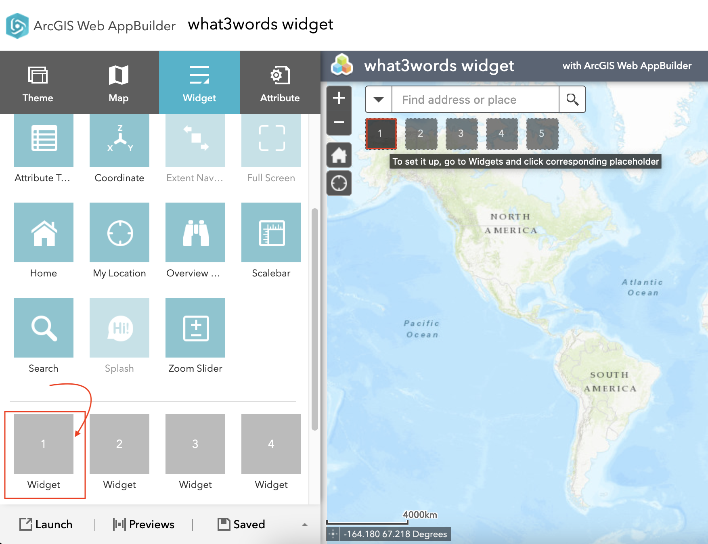
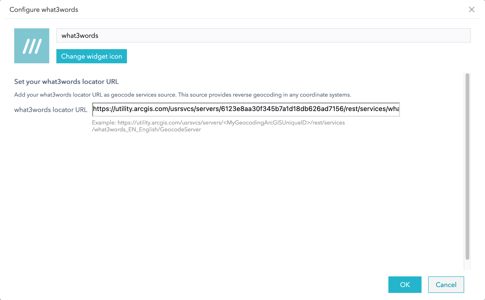
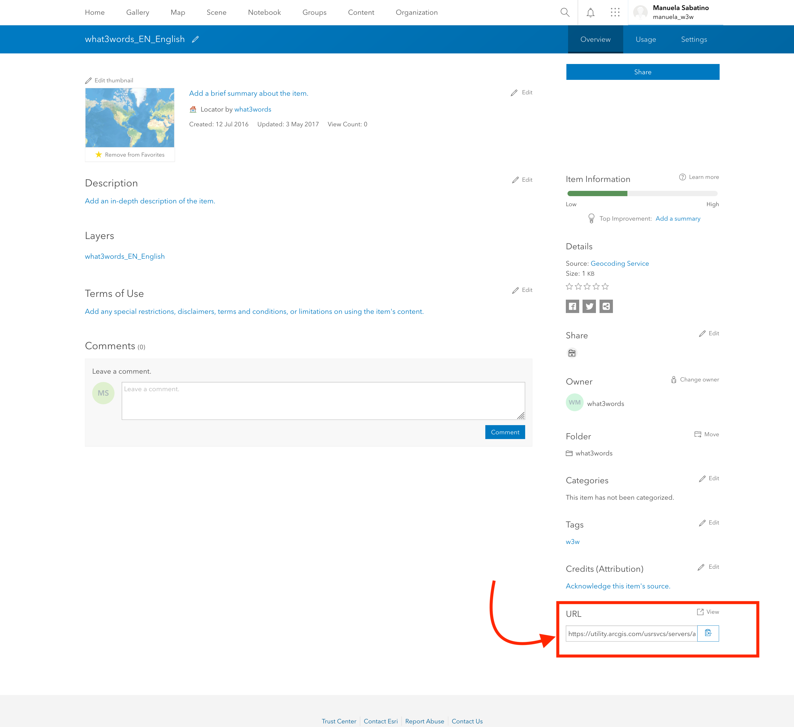
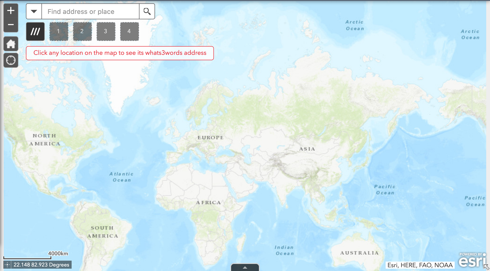
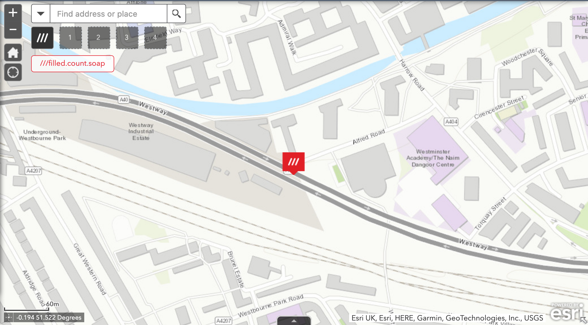

# <image src="https://what3words.com/assets/images/w3w_square_red.png" width="32" height="32">&nbsp;w3w-arcgis-webappbuilder-widget

A custom widget for [Web AppBuilder for ArcGIS](https://developers.arcgis.com/web-appbuilder/) providing reverse geocoding via the [what3words API](https://developer.what3words.com/public-api/docs).

## Prerequisites

- An installed and configured instance of [Web AppBuilder for ArcGIS (Developer Edition)](https://developers.arcgis.com/web-appbuilder/guide/getstarted.htm);
- a URL of your what3words Locator that has been added to your ArcGIS online or your Portal for ArcGIS by following this [instruction](https://developer.what3words.com/tools/gis-extensions/arcgis) on the what3words developer site;
- a copy of this widget.

## Installation and Configuration

- Deploy the widget by copying the `what3words` folder and its contents into your Web AppBuilder installation's `client/stemapp/widgets/` folder

- Run the [Web AppBuilder server](https://developers.arcgis.com/web-appbuilder/guide/getstarted.htm)

- Create your [own web app](https://developers.arcgis.com/web-appbuilder/guide/build-your-first-app.htm)

- Add a new widget

- Select the what3words widget

- Configure the widget with your what3words Locator URL

- To find the what3words Locator URL, go to your ArcGIS Online or Portal for ArcGIS, click on the `Content > My Organization` tab. Search for your locator, you could filter by `Item type > Tools > Locators` as shown on this image:

- Then click on your Locator, scroll down to the bottom of the page, on the right hand side, you will find the URL of your Locator that you will *copy and paste on the configuration page of the what3words widget*, as shown on this image:

- The widget is now ready to run inside your web app; click on the `///` button to activate the widget

- Clicking on the map will allow you to discover 3 word addresses at the clicked location

## Issues

Found a bug or want to request a new feature? Please let us know by [submitting an issue](https://github.com/what3words/w3w-arcgis-webappbuilder-widget/issues).

## Contributing

All contributions are welcome; please submit a pull request.

## Licensing

This widget is licensed under the MIT license; a copy of which can be found in the this repository's [license](LICENSE) file.
