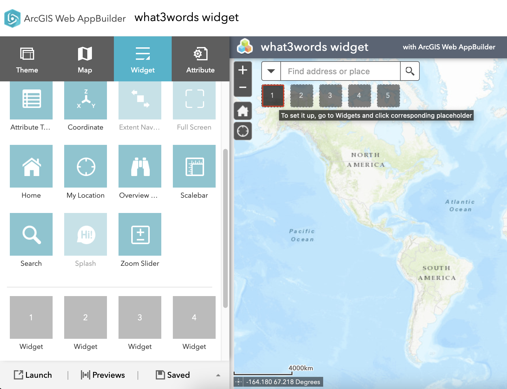
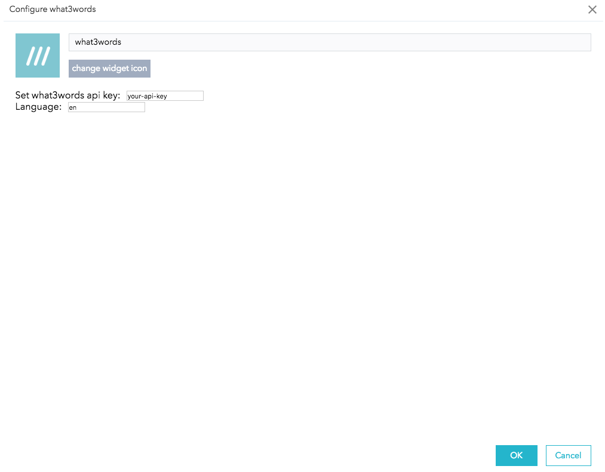
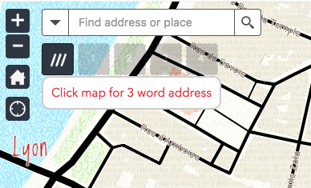

# <image src="https://what3words.com/assets/images/w3w_square_red.png" width="32" height="32">&nbsp;w3w-arcgis-webappbuilder-widget

This custom widget for ArcGIS Web AppBuilder is a reverse geocoder using what3words API.

### Quick start
You need a what3words API key. You can  [register](https://what3words.com/register?dev=true) easily.

You need a [Web AppBuilder for ArcGIS](https://developers.arcgis.com/web-appbuilder/) (Developer Edition)

Deploy the what3words widget copying the folder `w3wwidget` into `\client\stemapp\widgets`
(for information about ArcGIS Webapp Builder see esri's  [documentation](https://developers.arcgis.com/web-appbuilder/guide/deploy-your-widget.htm))

Run the server see esri's [documentation](https://developers.arcgis.com/web-appbuilder/guide/getstarted.htm).

Create you Webapp

Add the widget

Select what3words widget

Configure the widget with your API key and your preferred language

check all languages available with the what3words API using the method `languages`. See [documentation](https://docs.what3words.com/api/v2/#lang)

Now the widget is ready to run in you Webapp, click on the button to activate the widget

Then click on the map to discover the 3word address

### Issues
Find a bug or want to request a new feature? Please let us know by submitting an issue.

### Contributing
Anyone and everyone is welcome to contribute.

### Licensing
The MIT License (MIT)

A copy of the license is available in the repository's [license](LICENCE) file.
