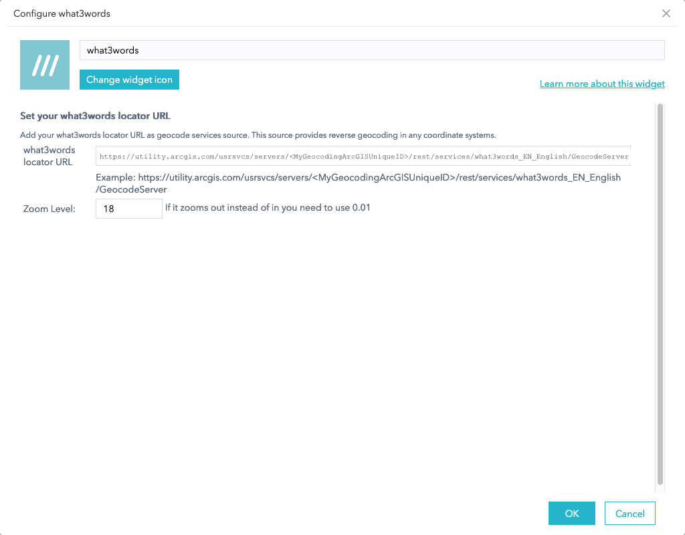

# <image src="https://what3words.com/assets/images/w3w_square_red.png" width="32" height="32">&nbsp;w3w-arcgis-webappbuilder-widget

A custom widget for [Web AppBuilder for ArcGIS](https://developers.arcgis.com/web-appbuilder/) providing reverse geocoding via the [what3words ArcGIS locator](https://developer.what3words.com/tools/gis-extensions/arcgis).

## Demo App
You can find the Custom Web AppBuilder what3words widget in this [Github page](https://what3words.github.io/w3w-arcgis-webappbuilder-widget/WebApp-what3words).

## Prerequisites

- An installed and configured instance of [Web AppBuilder for ArcGIS (Developer Edition)](https://developers.arcgis.com/web-appbuilder/guide/getstarted.htm);
- A URL of your what3words ArcGIS Locator that has been added to your ArcGIS online or your Portal for ArcGIS by following this [instruction](https://developer.what3words.com/tools/gis-extensions/arcgis) on the what3words developer site;
- A copy of this widget `what3words`.

## Installation and Configuration

- Deploy the widget by copying the `what3words` folder and its contents into your Web AppBuilder installation's `client/stemapp/widgets/` folder;

- Run the [Web AppBuilder server](https://developers.arcgis.com/web-appbuilder/guide/getstarted.htm);

- Create your [own Web Application](https://developers.arcgis.com/web-appbuilder/guide/build-your-first-app.htm);

- After you have created your own web application, you can now add the what3words widget to it by clicking on any of the empty widget on the left-hand side.

- A list of widgets will pop up. You can search the `what3words` widget by typing its name on the search bar at the top or look for the widget on the list. Once you have found it, please click on it. If the widget has been selected correctly, a tick will be shown on top of the icon of the widget.

- Configure the widget with your `what3words Locator URL`. 
    * By using the what3words locator, you would be able to retrieve the correct what3words address in any coordinate systems used on your web map. Example of a what3words Locator: `https://utility.arcgis.com/usrsvcs/servers/<MyGeocodingArcGISUniqueID>/rest/services/what3words_EN_English/GeocodeServer`.
    * You can also add a zoom level to choose how close or far you want to dispaly your what3words address.
    

- To find the what3words Locator URL, go to your ArcGIS Online or Portal for ArcGIS, click on the `Content > My Organization` tab. Search for your locator, you could filter by `Item type > Tools > Locators` as shown on this screenshot:

- Then click on your Locator, scroll down to the bottom of the page, on the right-hand side, you will find the URL of your Locator. You need to *copy and paste this URL to the configuration page of the what3words widget*, as shown on this screenshot.:

- The widget is now ready to run inside your web app. Click on the `///` button to activate the widget. A message will appear on the map: `Click any location on the map to see its whats3words address`.

- Clicking on the map will allow you to discover what3words addresses at the clicked location. For example, the point selected on the map returned this what3words address: `///filled.count.soap`.

## Issues

Found a bug or want to request a new feature? Please let us know by [submitting an issue](https://github.com/what3words/w3w-arcgis-webappbuilder-widget/issues).

## Contributing

All contributions are welcome; please submit a pull request.

## Licensing

This widget is licensed under the MIT license; a copy of which can be found in the this repository's [license](LICENSE) file.
